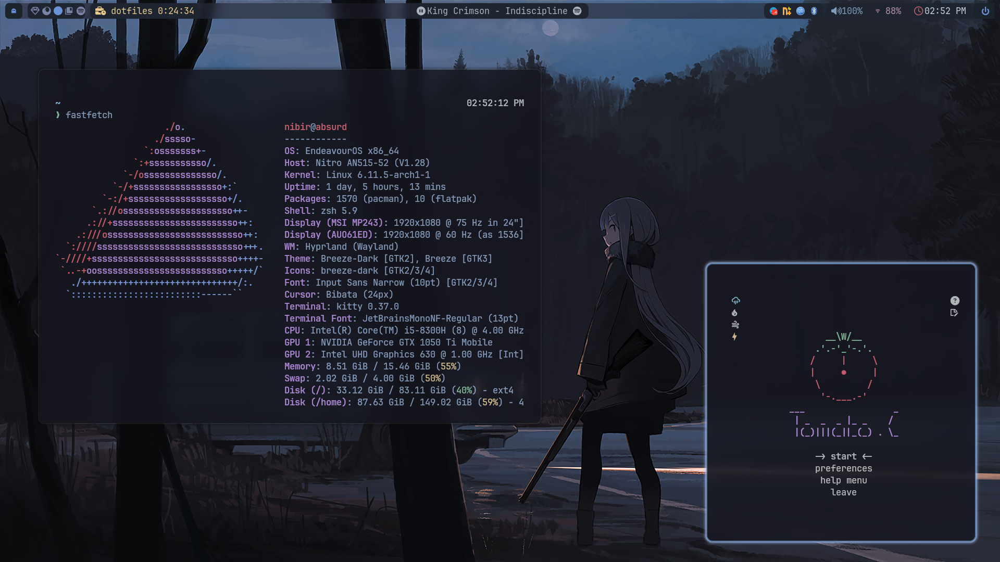
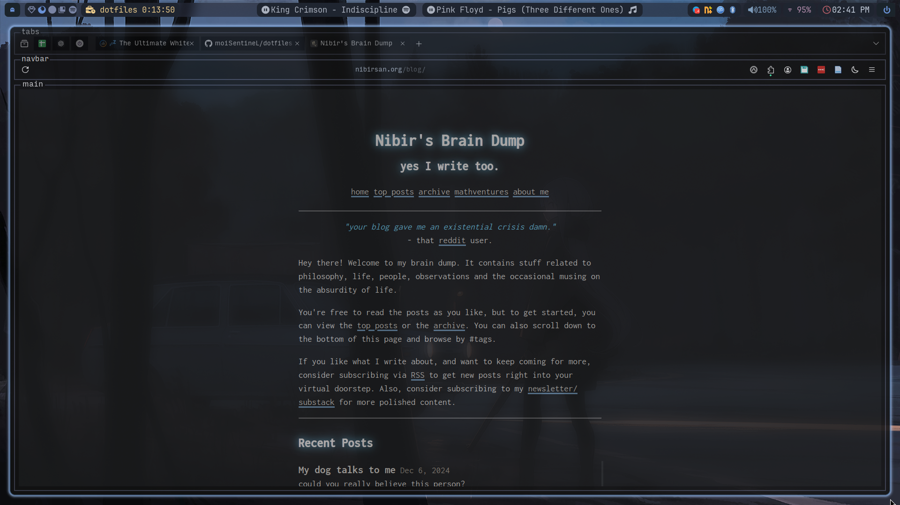
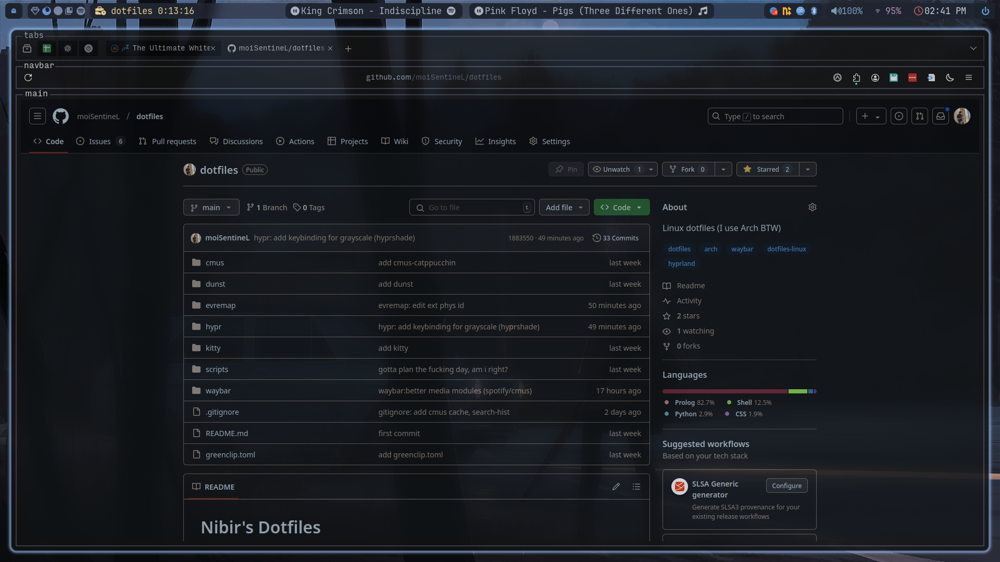
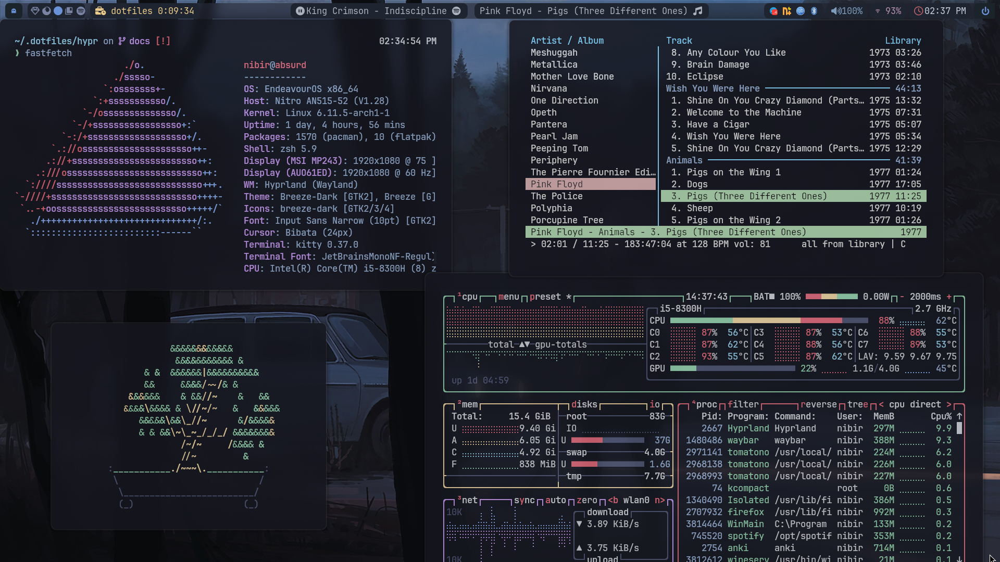
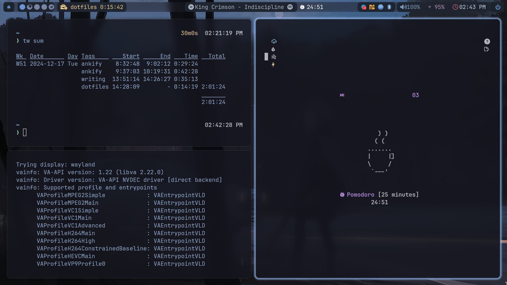
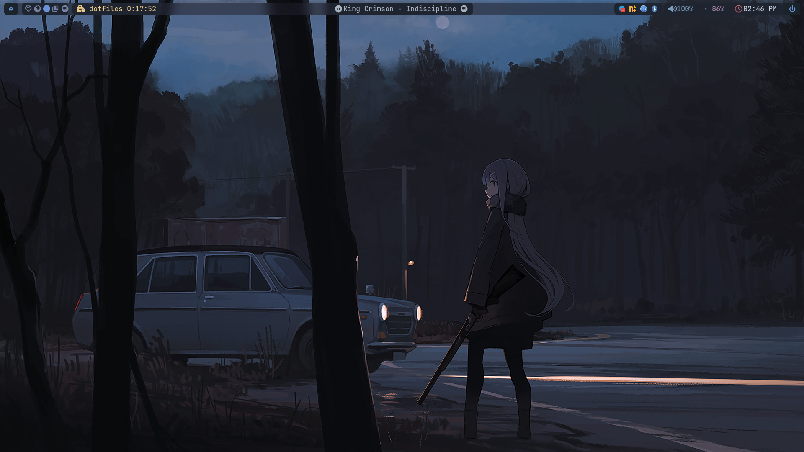

# Nibir's Dotfiles
Config files for Hyprland, waybar, kitty and many more.
This is an iteration of [1amSimp1e](https://github.com/1amSimp1e)'s [Late Night](https://github.com/1amSimp1e/dots/tree/late-night-%F0%9F%8C%83).

  
More Screenshots

  #### Firefox
  
  
  
  #### Terminals
  

  #### Pomo
  

  #### Wallpaper
  

## Philosophy
The system optimises for ergonomics and productivity while focusing on a bit of aesthetics.

Here are some of the rules:
- Functionality comes first.
- It is good as long as it serves the purpose.
- Generate friction for unwanted stuff, and make it easy to access the things that matter.
- Transition to minimalism.
## Features
- [Hypr-Ecosystem](https://hyprland.org/) for better integration and config:
	- Includes hypridle, hyprlock, hyprpaper, grimblast, etc.
	- NVIDIA config (follow Arch wiki)
	- Improved windowrules
- [Colemak [ED] + Extend Layers](https://dreymar.colemak.org/); using [evremap](https://github.com/wez/evremap) for remapping keys (Caps Lock -> tapping).
- [hyprshade](https://github.com/loqusion/hyprshade) shaders: grayscale and blue-light.
- Custom [waybar](https://github.com/Alexays/Waybar) modules:
	- Custom Weather based on `$ADDRESS` env. variable
	- Better Media Player controls: Spotify and [cmus](https://github.com/cmus/cmus).
	- [Tomato.C](https://github.com/gabrielzschmitz/Tomato.C)
	- [Timewarrior](https://timewarrior.net/) integration (**needs improvement**)
	- Better Workspaces
- [greenclip](https://github.com/erebe/greenclip): rofi clipboard
### What doesn't work
- Screen-sharing. Mostly probably because I don't update frequently (sorry!)
- Any NVIDIA-Wayland error. Can't do nothing about it.
- Electron Apps on Wayland are trash. I have to run Obsidian without GPU (`obsidian --disable-gpu`)
## Usage
The dotfiles are currently *not* at a production stage. I haven't tested it on anything except my own PC. Though, you can use the source files for any information and tweaks. For example, the waybar modules.

**Use at your own risk! Always make a backup first!** Read the source files before.
## Roadmap
They are usually tracked via Github issues, but...
- [ ] neovim config #2
- [ ] taskwarrior integration #3
- [ ] make screen-sharing work #4
- [ ] add `zsh`-related config #5
- [ ] better file-structure #6

## README in progress!
