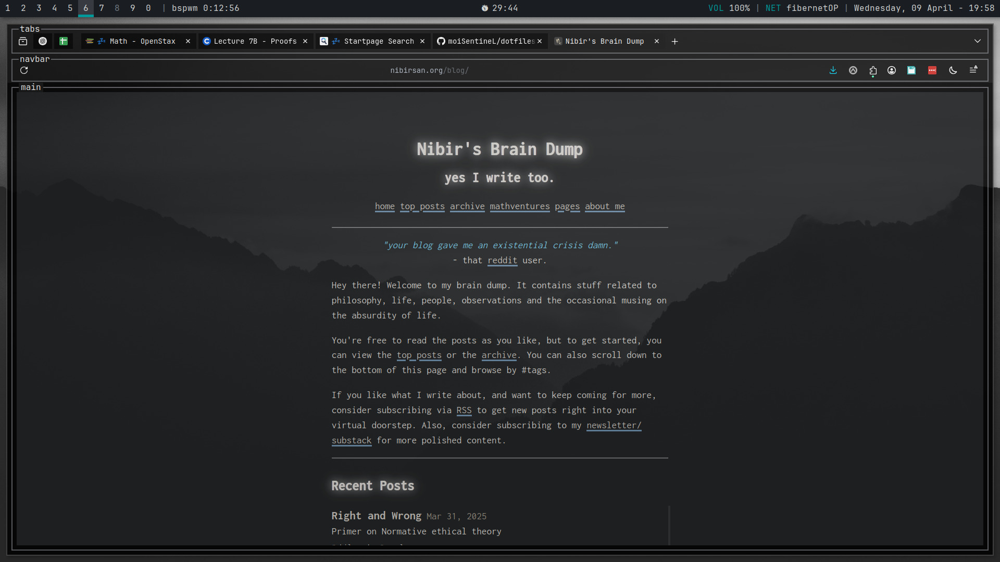
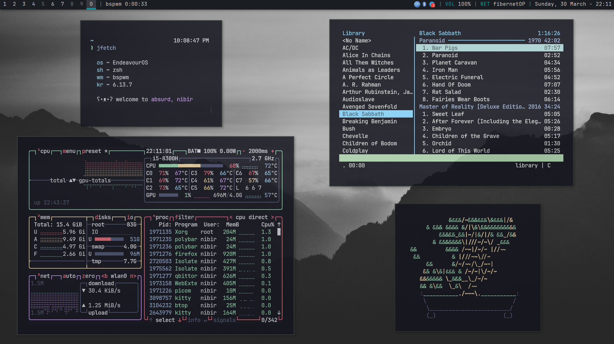
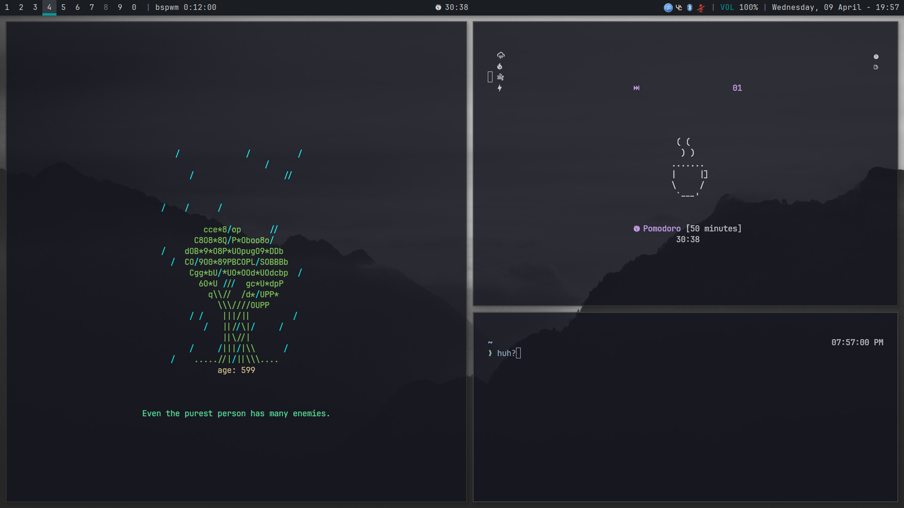
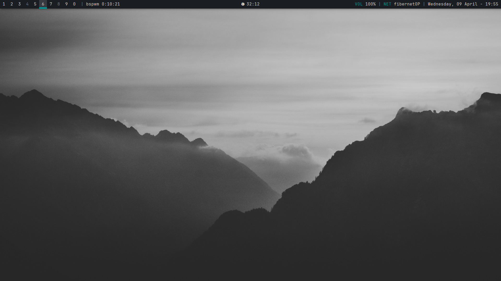

# Nibir's Dotfiles
### BSPWM Rice
or "**How to NOT use KDE Plasma ever again.**"

Check the [hyprland](https://github.com/moiSentineL/dotfiles/tree/hyprland) branch for my hyprland rice instead.

---

https://github.com/user-attachments/assets/73c7ec94-f26b-4f96-9b8c-9ed78877c0f8

  
More Screenshots

  #### Firefox
  
  
  #### Terminal
  

  #### Pomo
  

  #### Wallpaper
  

## Philosophy
The system optimises for ergonomics and productivity while focusing on a bit of aesthetics.

Here are some of the rules:
- Functionality comes first.
- It is good as long as it serves the purpose.
- Generate friction for unwanted stuff, and make it easy to access the things that matter.
- Transition to minimalism.
## Features
- [BSPWM](https://github.com/baskerville/bspwm) + [Polybar](https://github.com/polybar/polybar)
	- super speed multitasking
	- simple and minimal config 
- [Colemak [ED] + Extend Layers](https://dreymar.colemak.org/); using [evremap](https://github.com/wez/evremap) for remapping keys (Caps Lock -> tapping).
- Custom polybar modules:
	- [Tomato.C](https://github.com/gabrielzschmitz/Tomato.C)
	- [Timewarrior](https://timewarrior.net/) integration (**needs improvement**)
- [mpv-settings](https://github.com/moiSentineL/mpv-settings): nice mpv config
### What doesn't work
- no screensaver / screenlock yet. sorry!
- bindings are not yet configured *fully*.
- no clipboard history function yet.
## Usage
The dotfiles are currently *not* at a production stage. I haven't tested it on anything except my own PC. Though, you can use the source files for any information and tweaks. For example, the waybar modules.

**Use at your own risk! Always make a backup first!** Read the source files before.
## Roadmap
Check Github [Issues](https://github.com/moiSentineL/dotfiles/issues)

---

stay frosty.
